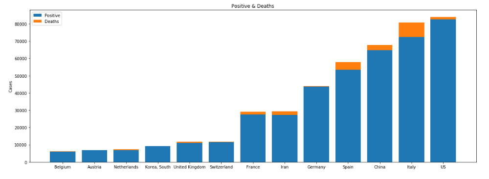
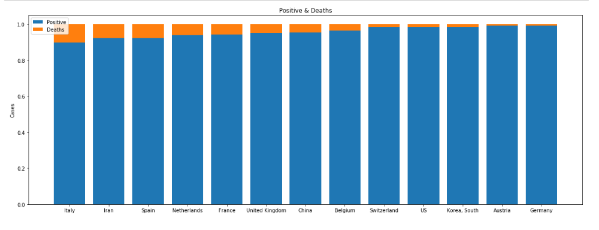
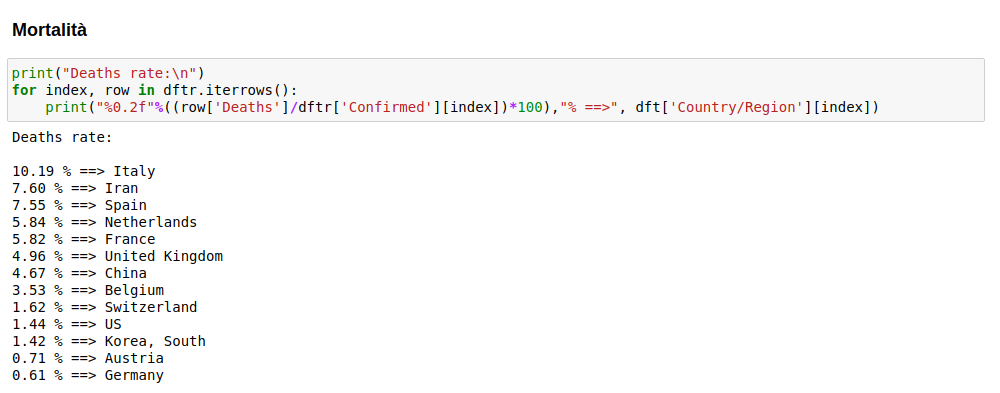
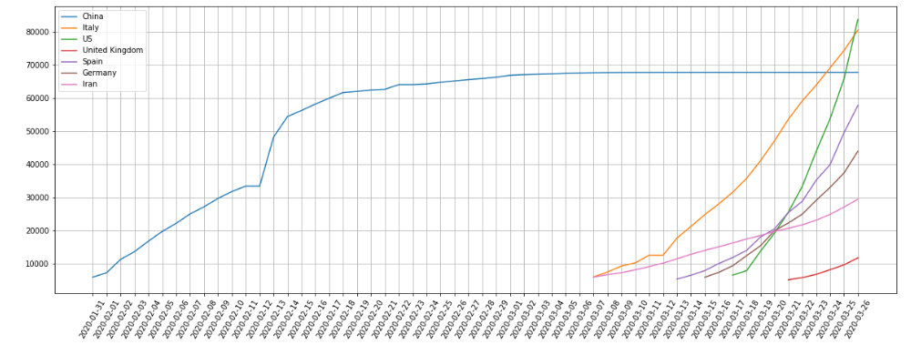

# Covid-19-nations
Questo notebook analizza i dati aggiornati da https://github.com/datasets/covid-19 sul numero di contagi di <b>Covid-19</b> per nazioni. 
È possibile:
* Visualizzare i dati cumulativi per nazione
* Visualizzare la mortalità delle nazioni più colpite
* Visualizzare i dati per date delle nazioni più colpite
* In aggiornamento...
  
Lo script fa uso dei dati rilasciati in (https://github.com/datasets/covid-19).

# Pre-requisiti
* `python 3`
* `jupyter`

# Installazione
* Clonare scaricare la repository
* Eseguire `jupyter notebook` da linea di comando
* Aprire il file <b>notebook.ipynb</b> dall'interfaccia web di Jupyter